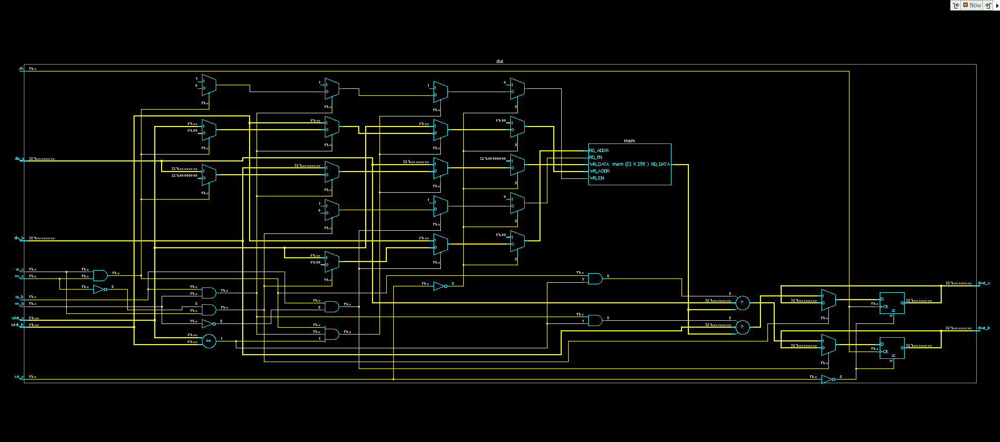
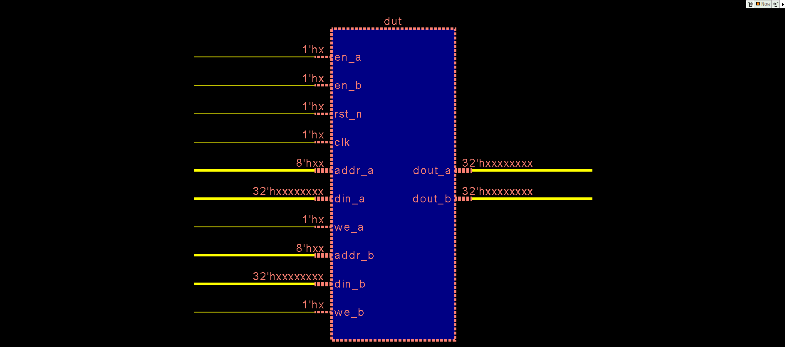

# Dual Port RAM (Verilog)

## Overview

This project implements a parameterizable synchronous **Dual-Port RAM** in Verilog. The memory supports two independent ports (Port A and Port B), allowing simultaneous read and write operations.

The module includes simple conflict handling and write-through (bypass) logic to produce deterministic behavior during concurrent accesses.

---

## RTL Schematic

### Top-Level Schematic

The following diagram shows the synthesized RTL structure of the Dual-Port RAM.



---

### Incremental Schematic

The following diagram provides a more detailed view of the internal logic, including read/write control and conflict handling.



---

## Features

* Parameterizable data width
* Parameterizable address width
* Dual independent ports
* Synchronous read
* Synchronous write
* Write-through (bypass) support
* Simultaneous write conflict handling
* Active-low asynchronous reset for output registers

---

## Parameters

| Parameter    | Description                   | Default           |
| ------------ | ----------------------------- | ----------------- |
| `DATA_WIDTH` | Width of each memory word     | 32                |
| `ADDR_WIDTH` | Address bus width             | 8                 |
| `DEPTH`      | Memory depth (`2^ADDR_WIDTH`) | `1 << ADDR_WIDTH` |

---

## Port Description

### Port A

| Signal   | Direction | Description  |
| -------- | --------- | ------------ |
| `en_a`   | Input     | Port enable  |
| `we_a`   | Input     | Write enable |
| `addr_a` | Input     | Address      |
| `din_a`  | Input     | Write data   |
| `dout_a` | Output    | Read data    |

### Port B

| Signal   | Direction | Description  |
| -------- | --------- | ------------ |
| `en_b`   | Input     | Port enable  |
| `we_b`   | Input     | Write enable |
| `addr_b` | Input     | Address      |
| `din_b`  | Input     | Write data   |
| `dout_b` | Output    | Read data    |

---

## Internal Signals

The module uses several internal signals to simplify the read/write control logic.

| Signal       | Description                                                                   |
| ------------ | ----------------------------------------------------------------------------- |
| `mem`        | Memory array with `DEPTH` locations, each `DATA_WIDTH` bits wide.             |
| `wr_a`       | Asserted when Port A performs a write operation (`en_a && we_a`).             |
| `wr_b`       | Asserted when Port B performs a write operation (`en_b && we_b`).             |
| `rd_a`       | Asserted when Port A performs a read operation (`en_a && !we_a`).             |
| `rd_b`       | Asserted when Port B performs a read operation (`en_b && !we_a`).             |
| `addr_match` | Asserted when both ports access the same memory address (`addr_a == addr_b`). |

These signals are used to:

* Detect read and write requests.
* Identify simultaneous accesses to the same address.
* Handle write conflicts.
* Implement write-through (bypass) behavior.

## Operation

### Write Operation
A write operation is performed when:

```text
en = 1
we = 1
```

On the rising edge of `clk`, `din` is stored at `mem[addr]`.

#### Example

```text
mem[4] = 0x00
```

Signals:

```text
en_a   = 1
we_a   = 1
addr_a = 4
din_a  = 0x3C
```

After the rising edge:

```text
mem[4] = 0x3C
```


### Read Operation

A read operation occurs when:

```text
en = 1
we = 0
```

#### Example

Suppose the memory contains:

```text
Address    Data
----------------
0x00       0x15
0x01       0x3A
0x02       0x7F
0x03       0xC4
```

Port A performs a read:

| Signal | Value |
|--------|-------|
| `en_a` | `1` |
| `we_a` | `0` |
| `addr_a` | `0x02` |

At the next rising edge of `clk`:

```text
dout_a = 0x7F
```

The memory contents remain unchanged.

## Simultaneous Access

### Different Addresses

If both ports access different addresses, both operations execute independently.

Example:

| Port A | Port B | Memory Before | Memory After |
|--------|--------|---------------|--------------|
| Write `0x55` → Addr `2` | Write `0xAA` → Addr `7` | `mem[2]=0x00`<br>`mem[7]=0x00` | `mem[2]=0x55`<br>`mem[7]=0xAA` |

Both writes succeed because the two ports access different addresses.

### Same Address Write Conflict
Both ports write to address **5** during the same clock cycle.

| Port A | Port B |
|--------|--------|
| Write `0x12` → Addr `5` | Write `0x34` → Addr `5` |

Since **Port A has priority**, the memory becomes:

```text
Before:
mem[5] = 0x00

After:
mem[5] = 0x12
```

The data `0x34` from Port B is ignored.

**Priority is given to Port A.**

The memory stores:

```
mem[X] = din_a
```

---

## Write-Through (Bypass)

When one port writes to an address while the other port reads the same address in the same clock cycle, the read port returns the newly written data instead of the old memory value.

### Write-Through (Port B → Port A)

Suppose:

```text
Before:
mem[10] = 0x55
```

During the same clock cycle:

| Port A | Port B |
|--------|--------|
| Read Addr `10` | Write `0xAA` → Addr `10` |

Without bypass:

```text
dout_a = 0x55
```

With write-through:

```text
dout_a = 0xAA
```

After the clock edge:

```text
mem[10] = 0xAA
```

### Write-Through (Port A → Port B)

Suppose:

```text
Before:
mem[3] = 0x20
```

During the same clock cycle:

| Port A | Port B |
|--------|--------|
| Write `0x7F` → Addr `3` | Read Addr `3` |

Result:

```text
dout_b = 0x7F
```

After the clock edge:

```text
mem[3] = 0x7F
```

## Reset Behavior

The active-low reset (`rst_n`) clears only the output registers:

```
dout_a = 0
dout_b = 0
```

The memory array (mem) is not reset, so all previously stored data remains unchanged after a reset.

This behavior is intentional and reflects the implementation of most FPGA Block RAMs and ASIC SRAMs, which typically do not provide a dedicated memory reset. Resetting every memory location is possible, but it is generally avoided because synthesis tools may no longer infer a Block RAM (FPGA) or SRAM macro (ASIC). Instead, the memory could be implemented using a large number of flip-flops or other logic resources, resulting in higher area and resource usage.

---

## Timing Summary

| Operation | Trigger                 |
| --------- | ----------------------- |
| Write     | Rising edge of `clk`    |
| Read      | Rising edge of `clk`    |
| Reset     | Falling edge of `rst_n` |

---

## Priority Rules

1. Port A has priority if both ports write the same address.
2. Read operations use write-through when another port writes to the same address in the same cycle.
3. Independent accesses to different addresses execute concurrently.

---

## Applications

* Register files
* Packet buffers
* FIFO storage
* Shared memory
* FPGA block RAM modeling
* ASIC memory modeling
